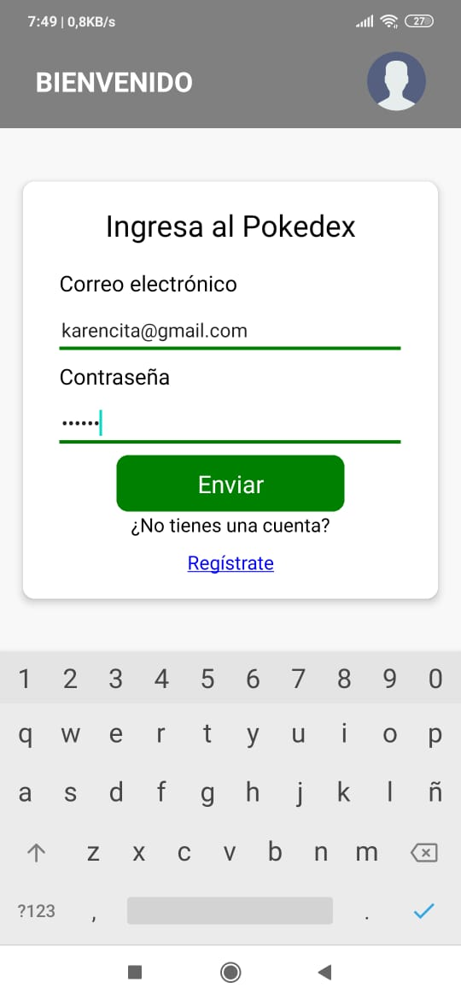

# Pokedex App - React Native

Una aplicación para ayudar a jugadores de Pokemon Go con React Native que ofrece una experiencia para seleccionar los pokemon preferidos para sus batallas.

## Funcionalidades Principales

### Pantalla de Cuenta

- **Acceso seguro:** Solo los usuarios autenticados pueden acceder a la pantalla de perfil ver sus pokemon favoritos.
- **Información del usuario:** Muestra detalles del usuario como su foto y su correo con el que esta logeado.

### Autenticación con Firebase

- Utiliza el sistema de autenticación de Firebase para gestionar el acceso de usuarios.
- Permite a los usuarios iniciar sesión y registrarse de manera segura.

### Pantalla de Tipo De Pokemon

- Muestra una selección de todos los tipos de pokemon.
- Al hacer clic en un tipo, navega a la pantalla de pokemon filtrado por dicho Tipo.
- Existe opción Todos para realizar sin filtro

### Pantalla de Lista de Pokemon

- Lista los pokemon con nombre e imagen.
- Al hacer clic en un pokemon, se navega a la pantalla de detalles del pokemon.
- Permite seleccionar el pokemon a favoritos

### Pantalla de Detalles del Pokemon

- Proporciona una descripción detallada del Pokemon.
- Permite seleccionar el pokemon a favoritos

### Pantalla de Pokemon Favoritos

- Muestr los pokemon seleccionados como favoritos
- Permite guardar los pokemon en la nube de firebase

### Pantalla de Perfil del Usuario

- Permite actualizar la foto de perfil del usuario.
- Permite ver el email con el que se registro.
- Permite cerrar la sesion del usuario.

### Navegación Inferior

- **Pestaña 1 - Pokedex:** Tipos y Pokemon (stack principal).
- **Pestaña 2 - Favoritos:** Muestra los pokemons favoritos seleccionados y permite guardarlos en la nube.
- **Pestaña 3 - Perfil:** Información del usuario, y carga de imagen de perfil.

## Tecnologías Utilizadas

- **Firebase Authentication:** Implementa el sistema de autenticación de Firebase para gestionar la seguridad de la aplicación.
- **React Native Navigation Stack:** Gestiona la navegación entre pantallas.
- **React Native Navigation Buttom tap:** Gestiona la navegación entre pestañas.
- **Expo-Picker-Image:** Facilita la carga de imágenes de perfil.
- **Redux:** Centraliza y gestiona el estado de la aplicación.
- **RTK Query y Firebase:** Realiza operaciones de lectura/escritura en la base de datos.
- **SQLITE:** Para almacenar datos locales en particular identificar que sigue logeado.

## Instalación

1. Clona el repositorio: `git clone https://github.com/YesicaChui/pokedex_navigator_react_native.git`
2. Instala las dependencias: `npm install`
3. Configura las claves de API para servicios externos.
4. Configura las credenciales de Firebase en tu proyecto.
5. Ejecuta la aplicación: `npm start`

## Contacto

Para preguntas o soporte, contacta a [yesicachuic@gmail.com].

---

